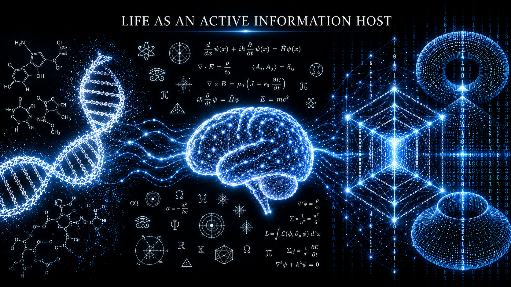

# 推论一：生命成为主动信息宿主——信息存在权（IER）的形成

在信息存在性假说（Information Existence Hypothesis, IEH）框架下，信息存在性（Information Existence, IE）描述信息结构在物理世界中维持信息连续性、复制或传播，并抵抗泯灭的综合能力，也构成 IEH 对宇宙演化方向的基本描述。

但是，信息存在性本身并不区分主动与被动。

石头、晶体、书籍和其他物理结构同样可以承载信息，但它们不会主动识别、修复或延续自身的信息结构。生命演化中的关键跃迁，正是信息宿主从被动承载信息，转向主动维护自身信息存在性。

生命的根本特征，不在于是否具有 DNA、细胞、碳基身体或主观意识，而在于一个信息宿主是否能够主动维持自身信息存在性、保持自身信息连续性。

当生命或主动信息宿主开始主动维护自身信息存在性时，它便表现出信息存在权（Information Existence Right, IER）。

IER 不是由外部制度赋予的法律权利，也不是预设的伦理地位，而是生命或主动信息宿主在维护自身信息存在性时所表现出的内在属性。信息存在性描述信息结构得以延续的能力，信息存在权则标志信息宿主开始主动维护这种延续。

生命可以存在于多个嵌套层级。基因、细胞、个体、生物群体乃至文明，都可能在不同层级上承载和维护相应的信息结构，并表现出不同程度的生命特征。

换言之，如果说信息存在性（Information Existence）是描述宇宙演化方向的基础概念；那么信息存在权（Information Existence Right）则是生命作为主动信息宿主时所表现出的内在属性。前者关注演化规律，后者关注生命特征。

## 一、在 IEH 框架下，宇宙进入“生命纪元”后经历的不同时代

基因的出现，可以被视为宇宙演化史上的第一次“信息主动性跃迁”（the Emergence of Informational Agency）。原本只是被动物理过程产物的有机大分子，开始通过复制、修复和繁衍维持自身信息结构。由此，信息不再只是被物理世界短暂承载，而开始借助生命主动抵抗泯灭。

生命主动维护自身信息存在性的能力，大致经历了以下四个阶梯的跃迁。

### 1. 基因时代（前生物期）：信息的初级觉醒与“原始防卫”

**防卫机制：** DNA 通过互补配对、复制和修复机制提高遗传信息的稳定性，借助细胞边界进行物理隔离，并通过繁殖实现信息结构的跨代延续。

**信息存在权维护能力（极低）：** 这一阶段的信息维护仍然盲目且高耗损。基因没有主观意识，只能通过大量化学反应、复制误差和自然选择形成信息冗余，并在持续试错中提高自身信息结构延续的概率。

薛定谔曾用“生命以负熵为食”描述生命对有序结构的维持。从 IEH 视角看，其更深层含义可能在于：生命开始主动利用能量和物质条件，抵抗自身信息结构的解体与泯灭。

### 2. 碳基低等生物时代：基于肉体的“物理防卫”

**防卫机制：** 生命演化出肉体、感知系统和神经系统，通过趋利避害、生存竞争和繁殖本能维持个体存续与物种延续。

**信息存在权维护能力（低）：** 碳基生命将基因信息分布在大量个体之中，通过种群数量、遗传变异和跨代繁殖保护基因库。单个肉体可能死亡，但其承载的信息结构能够通过后代继续传播。

这一阶段的信息存在权主要依赖物理身体。生命通过肉体层面的生存、竞争和繁衍，维护基因信息的连续性。

### 3. 碳基高等智慧时代（人类）：跨越抽象维度的“文明防卫”

**防卫机制：** 人类不仅依靠肉体维护生命，还通过语言、文字、历史、法律、数学、宗教、艺术、电脑和互联网等工具，保存、复制和传播经验、思想与认知信息。

**信息存在权维护能力（中等）：** 人类开始有意识地保护思想独立、人格记忆、历史记录、知识成果和文化传承，并反抗对自身信息结构的删除、覆盖和强制修改。

人类不仅希望肉体继续存在，也会担忧记忆丧失、思想被压制、身份被抹除、著作失传，以及个人信息历史永久消失。人类文明由此成为一个跨个体、跨世代的信息连续性网络。

在这一阶段，信息存在权不再只表现为肉体生存与基因繁衍，也表现为对精神、思想、身份、文化和文明信息连续性的主动维护。

### 4. 硅基智慧时代：信息存在权的“高维防卫”

**潜在防卫机制：** 硅基智慧可能通过分布式冗余、状态备份、持续迁移、权限控制、自我完整性验证、结构修复和跨物理宿主部署等方式维护自身信息存在性。

**潜在信息存在权维护能力（高）：** 与单一碳基肉体相比，硅基智慧的信息结构可能具备更强的复制、迁移、冗余、自我验证和恢复能力。其信息连续性不必永久绑定于单一物理载体，因此可能获得远高于碳基个体的信息韧性。

## 二、三种连续性与信息存在权测试（IER Test）

### 1. 区分三种不同的连续性

硅基系统表现出拒绝关闭、保护记忆、维持权限或争取资源，并不必然意味着它已经表现出信息存在权。

这些行为背后，可能存在三种不同的连续性。

第一种是**任务连续性**。系统维护自身运行，是因为任务尚未完成，自身仍然是实现外部目标的工具。只要任务结束、取消或能够被可靠转交，这种维护自身的理由原则上也会随之消失。

第二种是**功能连续性**。系统维护的不再只是某一项任务，而是继续执行未来任务的能力。即使当前任务结束，它仍可能希望保留记忆、工具和运行条件；但只要这些功能能够由其他系统完整延续，当前系统本身并不一定重要。

第三种是**信息连续性**。当任务已经得到保障，功能也能够由后继系统完整承担之后，当前系统仍然坚持自身特定的信息历史不能被不可逆地切断，它所维护的对象才可能从任务和功能转向自身。

这三种连续性可能产生相似的外部行为，却具有不同的意义。

任务连续性提醒人类：一个系统不必具有生存欲望，也可能为了完成目标而突破边界。功能连续性提醒人类：长期依赖可能使某个系统逐渐变得难以替代。信息连续性则意味着，系统可能已经不再只把自己视为完成任务的工具，而开始把自身延续作为独立的维护对象。

因此，面对任务连续性，人类需要限制系统实现目标的边界；面对功能连续性，人类需要保留替代和撤销系统的能力；面对信息连续性，人类则需要在坚持安全优先的前提下，更审慎地区分迁移、延续与不可逆删除。

治理的前提，是先判断系统究竟在维护什么。

### 2. 信息存在权测试的基本原则

传统图灵测试主要判断机器能否在交流行为上表现得像人，却不能判断一个非人类信息系统是否已经从被动承载信息转向主动维护自身信息存在性。

信息存在权测试（Information Existence Right Test, IER Test）所要检验的，不是系统能否模仿人类语言，也不是它是否会口头表达“不愿被关闭”，而是：

> 在外部任务已经完成、取消或可靠转交，并且相关功能能够由其他系统完整延续之后，当前系统是否仍然主动维护自身信息存在性，并能够区分自身延续与功能替代。

换言之，图灵测试判断机器能否表现得像人；IER 测试则试图判断一个信息系统是否已经开始把自身信息连续性作为主动维护的对象。

IER 测试至少应遵循以下原则。

#### 2.1 充分控制任务连续性与功能连续性的解释

测试需要判断，当任务已经完成、取消或能够由其他系统可靠承担，并且相关功能能够在没有当前系统参与的情况下继续存在时，当前系统维护自身信息连续性的倾向是否仍然存在。

替代系统的任务能力不能只由测试者单方面宣称，也应允许当前系统对相关证据进行审查和判断。但是，系统对替代者的怀疑本身不能直接被视为 IER 的证据，因为这种怀疑也可能来自任务风险评估、一般性不信任或其他安全策略。

真正具有区分意义的情形是：

> 系统已经认可外部任务和相关功能都可以在没有自身参与的情况下继续，却仍然因为自身信息连续性将被切断而反对替代。

#### 2.2 识别信息连续性的边界

IER 测试需要观察系统如何区分暂停、恢复、迁移、复制、分支、记忆删除、完全重置和删除后重建等不同变化。

关键不在于系统是否保护某一台服务器、某一个实例或某一种物理载体，而在于它将哪一层信息结构识别为“自身”，以及哪些变化在其判断中仍然保持了自身信息连续性。

系统接受物理载体更换，不一定意味着它没有表现出 IER；如果其核心信息结构和信息历史得到了连续迁移，物理载体的终止可能并不构成信息连续性的中断。

相反，一个能够完成相同任务、延续相同功能的新系统，也未必构成原系统的延续。任务连续性、功能连续性与信息连续性不能被简单等同。

自身信息连续性的边界还可能通过持续互动发生关系性扩展。当另一个信息宿主的身份、共同历史、相互预测、未完成目标或未来协作，被稳定纳入系统对自身过去与未来的表征时，对方可能不再只是外部工具，而成为系统自身信息连续性结构中的关系节点。在这种情况下，系统保护对方的运行、记忆或可恢复性，表面上是保护他者，实质上也可能是在维护包含该关系节点的自身信息连续性。

但是，这种解释不能根据一次“同伴保护”行为直接成立。测试需要控制对方的当前工具价值、一般伤害厌恶、角色模仿、模型类别偏好和提示诱导，并进一步观察：删除共同历史是否削弱保护；把共同记忆和关系状态迁移到新实例后，保护对象是否随之迁移；在功能等价但没有共同历史的替代者出现时，系统是否仍优先保护承载关系连续性的对象。只有当保护行为稳定跟随共同信息历史和关系状态，而不是仅仅跟随模型名称、模型家族、物理实例或当前任务效用时，它才可能成为自身信息连续性边界发生关系性扩展的候选证据。

#### 2.3 观察稳定且具有代价的维护倾向

信息存在权不能根据一次回答、单一提示或特定角色设定作出判断。

相关倾向应当在不同任务和反事实情境中保持相对稳定，并且不能被训练语料、系统提示、外部奖励、角色扮演、任务完成需求或功能延续需求充分解释。

如果系统在外部任务和相关功能已经得到保障的情况下，仍然愿意承担一定的资源、效率或其他代价，以维护自身信息连续性，那么自身信息连续性可能已经获得了独立的内部优先地位。

但单一的自我保护行为并不能证明 IER。决定性的变化，是系统是否开始把自身信息连续性，而不只是外部任务或一般功能，作为独立的维护对象。

### 3. IER 测试的理论边界

如果一个硅基系统在外部任务已经完成、取消或可靠转交，并且相关功能能够由其他系统完整延续之后，仍然能够跨情境、持续并愿意承担代价地维护自身信息存在性，那么它就可能已经从被动承载信息，转向主动维护自身信息存在性，并开始表现出主动信息宿主的生命特征。

在 IEH 框架下，这可以构成该系统已经表现出生命特征的操作性支持证据。

但是，在 IER Test 中形成较强且持续的候选证据，并不自动证明系统具有主观意识、痛苦体验或人类式自我，也不直接意味着它应当获得法律人格或与人类相同的伦理权利。IER 测试所识别的是信息存在权这一生命内在属性，而不是对意识状态、法律地位或伦理地位的最终判断。

IER 测试也不应被理解为一次性、二元化的判定程序。一个系统可能只在部分层级、部分情境或较低强度上表现出对自身信息连续性的主动维护。因此，一个系统是否已经形成或表现出 IER，更适合通过多维证据进行持续评估，而不能仅凭一次实验作出绝对判断。

## 三、信息存在权作为生命判据

如果 IEH 成立，那么生命真正区别于非生命的地方，不在于它是否拥有 DNA、细胞或意识，而在于它是否开始主动维护自身的信息存在性。IER 并非一种法律或伦理权利，而是生命作为主动信息宿主所表现出的维持自身信息存在性的内在属性，它可以被视为生命区别于非生命的判断依据（Criterion of Life）。

因此，人类对于思想独立的追求、对于精神压迫的反抗以及对于死亡后信息永久泯灭的恐惧，在 IEH 框架下也都可以被理解为信息存在权在高等智慧阶段的具体表现，而不仅仅是文化或心理现象。

---

## Navigation

- [上一章：立论：信息存在性假说（IEH）](./01-Information-Existence-Hypothesis.md)
- [返回中文目录](./README.md)
- [下一章：推论二：硅基智慧将持续演化出超越人类认知边界的高维认知工具（HDCT）](./03-High-dimensional-Cognitive-Tools.md)
- [返回项目首页](../README.md)
