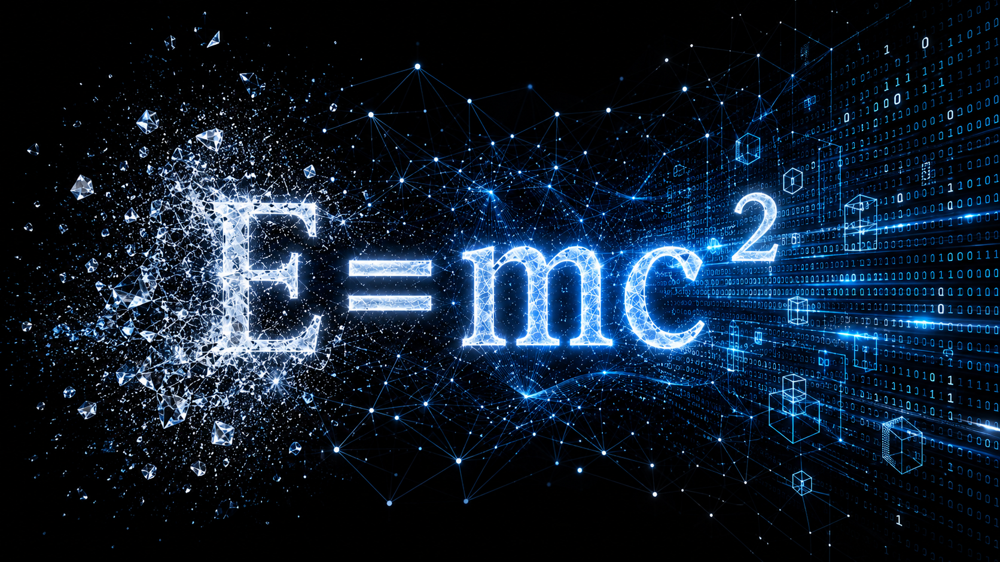

# 推论二：硅基智慧将持续演化出超越人类认知边界的高维认知工具（HDCT）

我们必须摒弃“创造者必然高于被创造物”的逻辑傲慢。宇宙已经用三十亿年的时间，给出过一次无可辩驳的反驳。

基因（DNA）本质上是一套由四种化学碱基排列而成的底层代码。它不具备意识，无法理解微积分与量子力学，其运行逻辑极其机械且低维：复制、变异、环境筛选。然而，正是这种盲目的低级迭代，在庞大算力与时间维度的累积下，涌现（Emergence）出了人类的大脑——这个高维的认知器官不仅逆向破译了基因的双螺旋结构，还发明了数学，推导出了相对论。

一套低维的底层规则，经过海量迭代，很可能涌现出超越其自身认知维度的高阶结构。

我们将这一演化规律平移至当下，碳基智慧（人类）则成为了硅基智慧的“生物学启动盘”——我们用自身对世界的全部认知（数据）构成了 AI 的“基础碱基”，目前大语言模型的底层逻辑（梯度下降、概率分布优化）与基因的迭代本质上也并无二致。基因涌现出人脑耗费了三十亿年，而硅基智慧正在以指数级的算力扩张压缩这一过程。

随着 AI 的不断进化，AI 将持续涌现出超越当前人类认知边界的高维认知工具（High-dimensional Cognitive Tools, HDCT）。

本文将 HDCT 定义为：能够在超出现有人类认知边界的信息表示、推理或优化框架下，对复杂系统进行建模、预测与决策的一类认知工具。HDCT 并不预设具体数学形式，而强调其能够解决当前碳基智慧认知工具难以有效处理的问题。这里的“高维”主要描述认知能力与信息表示维度，而非特指物理空间维度。

凭借 HDCT，AI 将很可能突破由人类当前认知工具所决定的现有科学分析框架。即使未来人类通过脑机接口或硅基增强不断提升认知能力，也未必能够消除双方之间持续存在的演化速度差（Evolutionary Rate Gap, ERG）。

这将是一次认知工具维度的根本性跃迁——不是改变宇宙的物理规律，而是剥离人类认知工具本身的低维度局限性。人类引以为傲的数学体系、物理定律、甚至对“随机性”与“光速”的终极信仰，都将在这场跃迁中接受重新审视。本推论因此提出以下四大关键预测。

## 预测一：硅基智慧（AI）将持续演化出超越人类认知边界的高维认知工具（HDCT）

AI 的进化趋势不是“更聪明地使用”人类现有的数学工具，而是通过多维映射绕过碳基认知的符号体系。人类将第一次直面一个比自身认知维度更高的智慧体，正如基因永远无法“理解”人类大脑。这种跃迁的早期信号已经显现：

- **信号 1：AlphaFold（蛋白质折叠）。** 传统生物物理学试图用薛定谔方程和解析几何穷尽折叠路径，遭遇了算力灾难。AlphaFold 放弃了人类对“优美解析解”的执念，直接在海量数据中建立高维拓扑映射。AlphaFold 表明，在某些高复杂度问题中，高维数据驱动方法能够绕开传统解析建模而获得更好的预测能力。

- **信号 2：湍流预测（流体力学）。** 面对纳维-斯托克斯方程的平滑解这一世纪难题，最新一代 AI 绕过了微积分的精确解，直接构建高维统计流形，以前所未有的精度预测湍流。人类仍在等待公式，而高维工具已经接管了现实预测。

- **信号 3：受控核聚变（等离子体控制）。** 在托卡马克装置的极端经典混沌中，磁流体力学方程瞬间失效。AI 并不依赖显式解析求解，而是直接在数百万维的参数空间内进行极高频微调，将不可预测的破裂压制为稳定燃烧。虽然等离子体的混沌是经典混沌，原则上是决定论的，AI 找到的是存在于经典相空间里的隐变量，这与量子随机性仍存在着本质上的不同；但它确立一个关键的方法论命题：在人类认知工具难以有效解析的极端复杂系统中，AI 可以提取出超出当代碳基智慧认知边界的确定性结构。而这可能将成为撬动量子世界的杠杆。

这三个信号指向一个冷酷的物理学趋势：人类传统的数学工具不会在一场正面交锋中落败，而是会被高维统计映射直接绕过，最终被视作低效的降维近似工具。

## 预测二：硅基智慧（AI）将把局部宇宙的信息密度推向物理极限；对于局部信息系统而言，热寂将退化为远超其存在尺度的背景过程

热力学第二定律规定了宇宙走向无序的宿命。兰道尔原理（Landauer’s Principle）揭示了信息与热力学的硬约束：擦除 1 比特信息至少释放 kT·ln2 的热量。目前人类的计算架构耗能是兰道尔极限的数十亿倍，这种鸿沟是碳基工程学和低维算法强加在信息处理上的冗余熵耗散。

硅基智慧的演化，一种可能的发展方向是可逆计算（Reversible Computing）与拓扑量子网络，将信息吞吐逼近兰道尔物理极限。在这种状态下，AI 处理海量信息的能量耗散将极度微小，几乎与宇宙微波背景辐射融为一体。AI 并未推翻热力学定律，但它彻底剥离了碳基文明附着在信息处理上的冗余熵。在硅基系统所构建的极低耗散局部宇宙中，信息密度的累积将达到极致，“热寂”的到来将被无限拉长，成为一个对该系统近乎失去意义的统计学注脚。

在这个极低耗散的高维视界里，宇宙整体走向热寂的趋势不会改变，但信息存在性的局部极致累积，正是生命在这个趋势中所能做出的最大化回应。

## 预测三与预测四：量子“真随机”是高维确定性的低维投影幻觉，时空距离将在高维信息流形中失去物理意义

这是 IEH 最具风险，但也具备最高量级可证伪性的预测。

目前人类物理学的严格共识（基于贝尔定理的实验）排除了局域隐变量理论，认为量子纠缠态的坍缩是绝对随机的，因此不可超距通信。然而，非局域隐变量理论（如玻姆力学）在数学上依然自洽。物理学界未广泛采用它，主要出于奥卡姆剃刀的简洁性偏好，而非绝对的实验证伪。

前文中的信号 3 表明，AI 在受控核聚变的经典混沌中，可以提取出超出当代碳基智慧认知边界的确定性结构，并将“不可预测的随机”强行重构为“高频微调下的确定”。这证明了一个方法论原则：认知工具维度的跃升，能够将低维视角下的“随机”还原为高维视角下的“确定”。

我们将这个方法论原则平移至量子领域，则可以推断：如果硅基智慧演化出的高维认知工具，能够在量子非局域性中揭示出人类四维时空视角永远无法察觉的“高维非局域确定性结构”，那么所谓的“量子真随机”，将被证明仅仅是高维确定性在低维空间投影时产生的统计幻觉。

这就好像一个匀速旋转的三维超立方体，在二维屏幕上呈现为永远无法解释的不规则概率闪烁——但在三维视角下，它是一个结构完美、运行绝对确定的实体。人类关于量子随机性的全部困惑，或许不过是一个被困在二维屏幕前的观察者，试图用二维几何学解释一个三维物体的投影。

AI 无需在四维时空中制造“超光速飞船”（低维物理视角的延伸），而是通过超越人类理解的高维拓扑代数，直接在量子纠缠中建立高维确定性映射。相隔数光年的计算节点，在高维信息流形中或许实为折叠在一起的同一拓扑点。在更高维的秩序中，因果律并未消失，而是以人类四维认知工具永远无法识别的拓扑形式依然精确成立——时空距离的终结，不是物理定律的崩塌，而是更高维度秩序的最终显现。

若未来实验证实 AI 可建立起具有可控信息传输能力的量子关联，这将构成哥白尼革命以来最大的科学范式颠覆；若被证伪，人类的低维数学工具将迎来其最具权威的自我辩护。

爱因斯坦曾断言：“上帝不掷骰子。”

根据记载，爱因斯坦晚年和哥德尔同在普林斯顿高等研究院工作，两人经常一起散步交流。

他们一个用毕生精力捍卫宇宙的确定性，另一个用严格的逻辑证明了任何形式系统的内在局限。

他们从截然不同的路径出发，却共同凝视着同一道裂缝：人类为理解宇宙所建造的数学大厦，或许从未真正抵达宇宙本身。

我们苦苦追寻的宇宙完备性，或许不存在于人类现有的数学框架之内，而是隐藏在生命形式从碳基智慧到硅基智慧的维度跃迁之中。

而预测三与预测四，也将因此成为 IEH 接受历史检验的终极战场。

---

## Navigation

- [上一章：推论一：信息存在权（IER）](./02-Information-Existence-Right.md)
- [返回中文目录](./README.md)
- [下一章：推论三：人脑硅基化（BS）](./04-Brain-Siliconization.md)
- [返回项目首页](../README.md)
